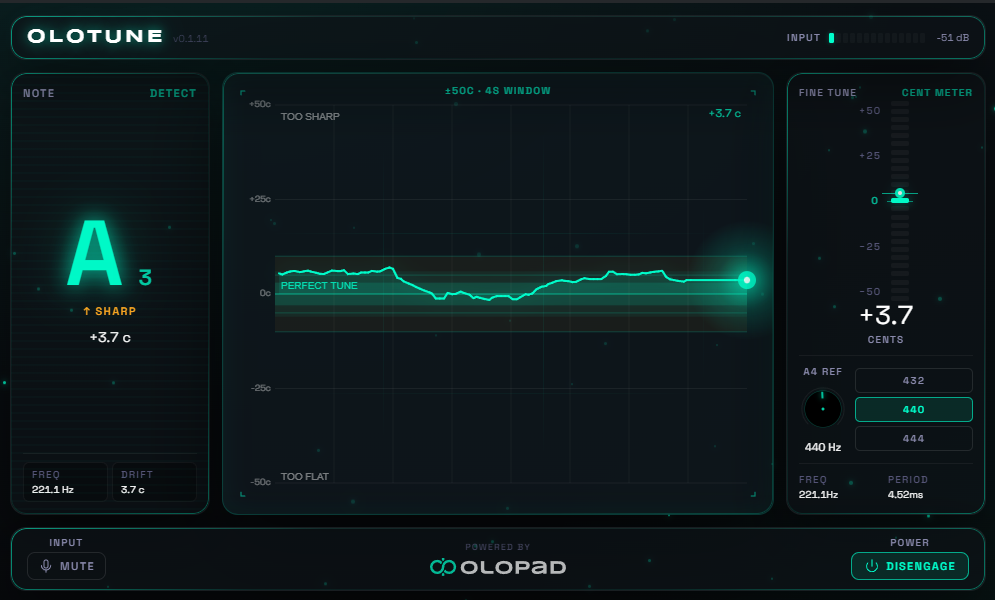

# OloTune

**A guitar tuner that lives in your DAW.** VST3 plug-in **and** standalone
desktop app — drop it on a guitar track in any modern host, or run it on
its own. Free, with a one-time OloPad sign-in on first launch.

[**Download the latest release →**](https://github.com/olopad-com/olotune/releases/latest)
&nbsp;·&nbsp;
[Product page](https://olopad.com/products/olotune)
&nbsp;·&nbsp;
[OloPad](https://olopad.com)

## Why this one

Most plug-in tuners are choppy meters that update ten times a second and
tell you "you're flat" without showing the *shape* of how flat. OloTune
runs a sliding YIN window at ~43 Hz, draws a four-second plasma trail of
your last few seconds of pitch, and renders the whole thing in the OloPad
cyan-teal cybernetic visual language so the guitar track in your session
finally has something nice to look at.

- **±0.5¢ accuracy** — sub-frame YIN, not the ~10 Hz of cheap plug-in tuners.
- **A chart, not a meter** — see drift, vibrato, and intonation at a glance.
- **VST3 + Standalone in one installer** — pick where the .vst3 lands.
- **Reference A4 from 415 to 466 Hz** — orchestral, baroque, custom tunings.
- **Offline-first** — fonts and assets bundled; no network calls during use.
- **Quiet auto-updates** — a small "new version available" chip in the top
  bar when there's a newer release. No nag dialogs, no telemetry.

## Install

1. Grab `OloTune-Setup-<version>.exe` from
   [the latest release](https://github.com/olopad-com/olotune/releases/latest).
2. Run the installer. It places the standalone in your Start Menu and
   asks where to put the `.vst3`:
   - **Per-machine** (default, requires admin) — `C:\Program Files\Common Files\VST3\`
   - **Per-user** — `%LOCALAPPDATA%\Programs\Common\VST3\` if you'd
     rather skip the UAC prompt.
3. First launch opens a single browser tab to sign in with your OloPad
   account. Takes about ten seconds. After that the plug-in works
   offline forever.

### Requirements

- Windows 10 / 11, x64
- WebView2 runtime — pre-installed on Windows 11; Windows 10 users can
  grab it from
  [Microsoft](https://developer.microsoft.com/microsoft-edge/webview2/).
- A free [OloPad](https://olopad.com) account (used once, on first launch)

### Hosts known to work

VST3 in Cubase, Reaper, Live, Studio One, FL Studio, Bitwig, Logic (via
the JUCE adapter). Standalone works without any DAW.

## FAQ

**Is it really free?** Yes. Forever. Full feature set, no premium tier,
no recurring charge. The OloPad account is just so the download link
stays tied to your profile and we can ping you about bug-fix releases.

**Why no VST2 / AU / AAX?** VST3 is what every modern DAW loads natively;
Steinberg discontinued the VST2 SDK programme in 2018, and AAX requires
a paid PACE/iLok signing licence we don't think makes sense for a free
plug-in with one maintainer today. AU support arrives with macOS.

**macOS? Linux?** Windows is what ships today. macOS is on the roadmap
(Universal binary, AU + VST3 + Standalone, signed and notarised). Linux
is unlikely in v1.

**Does it modify my audio?** No. The plug-in is pass-through — just a
listener. Detection runs locally, no audio leaves your machine.

**What does the plug-in send over the network?** Two things, both
minimal:

1. A first-launch handshake with the OloPad sign-in service to issue a
   per-machine licence token (kept in `%LOCALAPPDATA%\OloPad\OloTune`).
2. A once-a-day check against this repo's `/releases/latest` endpoint to
   surface the "new version available" chip.

That's it. No telemetry, no audio uploads, no third-party scripts.

## Reporting bugs

Open an issue here:
[github.com/olopad-com/olotune/issues](https://github.com/olopad-com/olotune/issues).
Please include your DAW + version, OS build, and a screenshot of the
plug-in window if there's a visual glitch.

## Releases

Each release tags a Windows installer. The plug-in's update checker hits
this repo's `/releases/latest` endpoint at most once per 24 h and shows a
chip when a newer tag is available. Click the chip to come straight here.

---

Built by [OloPad](https://olopad.com). © OloPad — all rights reserved.
